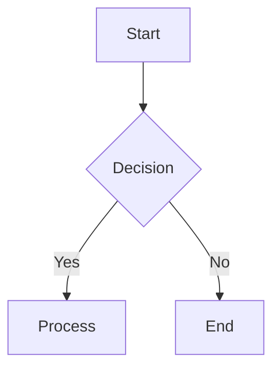

# opencode-mermaid-renderer

Render mermaid diagrams as beautiful ASCII art directly in OpenCode.

Powered by [beautiful-mermaid](https://github.com/lukilabs/beautiful-mermaid) from Craft.

## Usage

Add the plugin to your `.opencode/opencode.jsonc`:

```jsonc
{
  "plugin": ["opencode-mermaid-renderer@0.0.1"]
}
```

## Example

When the AI generates a mermaid diagram:

````markdown

````

The plugin automatically renders it as ASCII art:

```
┌──────────┐            
│          │            
│  Start   │            
│          │            
└─────┬────┘            
      │                 
      │                 
      │                 
      │                 
      ▼                 
┌──────────┐            
│          │            
│ Decision ├──No────┐   
│          │        │   
└─────┬────┘        │   
      │             │   
      │             │   
     Yes            │   
      │             │   
      ▼             ▼   
┌──────────┐     ┌─────┐
│          │     │     │
│ Process  │     │ End │
│          │     │     │
└──────────┘     └─────┘
```

## Supported Diagram Types

- **Flowcharts** - `graph TD`, `graph LR`, `graph BT`, `graph RL`
- **State diagrams** - `stateDiagram-v2`
- **Sequence diagrams** - `sequenceDiagram`
- **Class diagrams** - `classDiagram`
- **ER diagrams** - `erDiagram`

## Error Handling

If a mermaid diagram fails to render (invalid syntax, unsupported features), the plugin keeps the original code block and adds an HTML comment with the error:

```markdown
```mermaid
invalid syntax here
```
<!-- mermaid render failed: Parse error... -->
```

## Requirements

- OpenCode >= 1.0.137

## License

MIT

## Credits

- [beautiful-mermaid](https://github.com/lukilabs/beautiful-mermaid) by Craft/Lukilabs
- Inspired by [@franlol/opencode-md-table-formatter](https://github.com/franlol/opencode-md-table-formatter)
